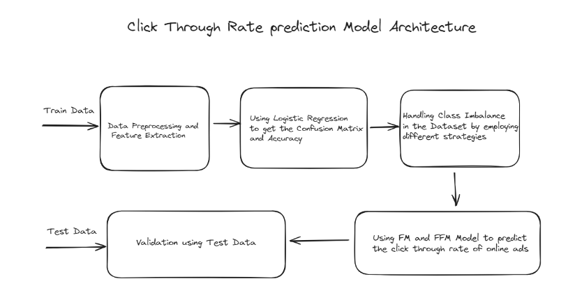

## Click Through Rate Prediction

ML program that can predict whether someone will click on an online ad as it crucial for understanding how well ads are doing, which is important for search engines.

**Model Architecture**



**Dataset**

[Avazu Ads Dataset](https://www.kaggle.com/competitions/avazu-ctr-prediction/data)

Class Imbalance : There are less number of clicks on ads compared to non-clicks

Attributes : ```click: non-click/click , site_id , site_domain , site_category , app_id , app_domain , app_category , device_id , device_ip , device_model , device_type , device_conn_type.```


**Imbalance Learning Strategies Used**

- SMOTE
- Oversampling
- Undersampling